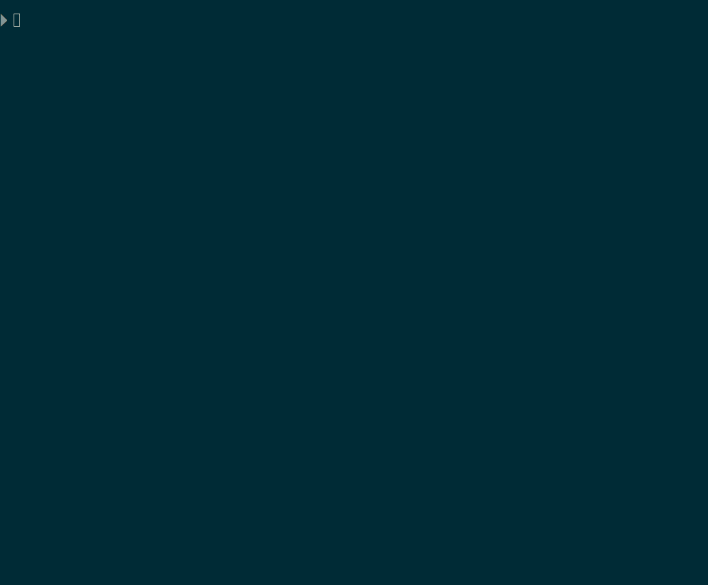

[](https://www.npmjs.com/package/site-audit-seo) [](https://www.npmjs.com/package/site-audit-seo)

Web service and CLI tool for SEO site audit: crawl site, lighthouse all pages, view public reports in browser. Also output to console, json, csv.

Web view report - [json-viewer](https://json-viewer.popstas.pro/).

Demo:
- [Default report](https://json-viewer.popstas.pro/?url=https://site-audit.viasite.ru/reports/blog.popstas.ru-default.json)
- [Lighthouse report](https://json-viewer.popstas.pro/?url=https://site-audit.viasite.ru/reports/blog.popstas.ru-lighthouse.json)
- [Default + Basic Lighthouse report](https://json-viewer.popstas.pro/?url=https://site-audit.viasite.ru/reports/blog.popstas.ru-default-plus-lighthouse.json)

Русское описание [ниже](#русский)



## Using without install
Open https://json-viewer.popstas.pro/. Public server allow to scan up to 100 pages at once.

## Features:
- Crawls the entire site, collects links to pages and documents
- Does not follow links outside the scanned domain (configurable)
- Analyse each page with Lighthouse (see below)
- Analyse main page text with Mozilla Readability and Yake
- Search pages with SSL mixed content
- Scan list of urls, `--url-list`
- Set default report fields and filters
- Scan presets
- Documents with the extensions `doc`,` docx`, `xls`,` xlsx`, `ppt`,` pptx`, `pdf`,` rar`, `zip` are added to the list with a depth == 0

## Technical details:
- Does not load images, css, js (configurable)
- Each site is saved to a file with a domain name in `~/site-audit-seo/`
- Some URLs are ignored ([`preRequest` in `src/scrap-site.js`](src/scrap-site.js#L98))

### Web viewer features:
- Fixed table header and url column
- Add/remove columns
- Column presets
- Field groups by categories
- Filters presets (ex. `h1_count != 1`)
- Color validation
- Verbose page details (`+` button)
- Direct URL to same report with selected fields, filters, sort
- Stats for whole scanned pages, validation summary
- Persistent URL to report when `--upload` using
- Switch between last uploaded reports
- Rescan current report


### Fields list (18.08.2020):
- url
- mixed_content_url
- canonical
- is_canonical
- previousUrl
- depth
- status
- request_time
- redirects
- redirected_from
- title
- h1
- page_date
- description
- keywords
- og_title
- og_image
- schema_types
- h1_count
- h2_count
- h3_count
- h4_count
- canonical_count
- google_amp
- images
- images_without_alt
- images_alt_empty
- images_outer
- links
- links_inner
- links_outer
- text_ratio_percent
- dom_size
- html_size
- html_size_rendered
- lighthouse_scores_performance
- lighthouse_scores_pwa
- lighthouse_scores_accessibility
- lighthouse_scores_best-practices
- lighthouse_scores_seo
- lighthouse_first-contentful-paint
- lighthouse_speed-index
- lighthouse_largest-contentful-paint
- lighthouse_interactive
- lighthouse_total-blocking-time
- lighthouse_cumulative-layout-shift
- and 150 more lighthouse tests!


## Install

## Zero-knowledge install
Requires Docker.

### Windows: download and run `install-run.bat`.
Script will clone repository to `%LocalAppData%\Programs\site-audit-seo` and run service on http://localhost:5302.


### Linux/MacOS:
```
curl https://raw.githubusercontent.com/viasite/site-audit-seo/master/install-run.sh | bash
```

Script will clone repository to `$HOME/.local/share/programs/site-audit-seo` and run service on http://localhost:5302.

Service will available on http://localhost:5302

##### Default ports:
- Backend: `5301`
- Frontend: `5302`
- Yake: `5303`

You can change it in `.env` file or in `docker-compose.yml`.

## Install with NPM:
``` bash
npm install -g site-audit-seo
```

#### For linux users
``` bash
npm install -g site-audit-seo --unsafe-perm=true
```

After installing on Ubuntu, you may need to change the owner of the Chrome directory from root to user.

Run this (replace `$USER` to your username or run from your user, not from `root`):
``` bash
sudo chown -R $USER:$USER "$(npm prefix -g)/lib/node_modules/site-audit-seo/node_modules/puppeteer/.local-chromium/"
```

## Install developer instanse with docker-compose
``` bash
git clone https://github.com/viasite/site-audit-seo
cd site-audit-seo
git clone https://github.com/viasite/site-audit-seo-viewer data/front
docker-compose pull # for skip build step
docker-compose up -d
```

Error details [Invalid file descriptor to ICU data received](https://github.com/puppeteer/puppeteer/issues/2519).

## Command line usage:
```
$ site-audit-seo --help
Usage: site-audit-seo -u https://example.com

Options:
  -u --urls <urls>                  Comma separated url list for scan
  -p, --preset <preset>             Table preset (minimal, seo, seo-minimal, headers, parse, lighthouse,
                                    lighthouse-all) (default: "seo")
  -t, --timeout <timeout>           Timeout for page request, in ms (default: 10000)
  -e, --exclude <fields>            Comma separated fields to exclude from results
  -d, --max-depth <depth>           Max scan depth (default: 10)
  -c, --concurrency <threads>       Threads number (default: by cpu cores)
  --lighthouse                      Appends base Lighthouse fields to preset
  --delay <ms>                      Delay between requests (default: 0)
  -f, --fields <json>               Field in format --field 'title=$("title").text()' (default: [])
  --default-filter <defaultFilter>  Default filter when JSON viewed, example: depth>1
  --no-skip-static                  Scan static files
  --no-limit-domain                 Scan not only current domain
  --docs-extensions <ext>           Comma-separated extensions that will be add to table (default:
                                    doc,docx,xls,xlsx,ppt,pptx,pdf,rar,zip)
  --follow-xml-sitemap              Follow sitemap.xml (default: false)
  --ignore-robots-txt               Ignore disallowed in robots.txt (default: false)
  --url-list                        assume that --url contains url list, will set -d 1 --no-limit-domain
                                    --ignore-robots-txt (default: false)
  --remove-selectors <selectors>    CSS selectors for remove before screenshot, comma separated (default:
                                    ".matter-after,#matter-1,[data-slug]")
  -m, --max-requests <num>          Limit max pages scan (default: 0)
  --influxdb-max-send <num>         Limit send to InfluxDB (default: 5)
  --no-headless                     Show browser GUI while scan
  --remove-csv                      Delete csv after json generate (default: true)
  --remove-json                     Delete json after serve (default: true)
  --no-remove-csv                   No delete csv after generate
  --no-remove-json                  No delete json after serve
  --out-dir <dir>                   Output directory (default: "~/site-audit-seo/")
  --out-name <name>                 Output file name, default: domain
  --csv <path>                      Skip scan, only convert existing csv to json
  --json                            Save as JSON (default: true)
  --no-json                         No save as JSON
  --upload                          Upload JSON to public web (default: false)
  --no-color                        No console colors
  --partial-report <partialReport>
  --lang <lang>                     Language (en, ru, default: system language)
  --no-console-validate             Don't output validate messages in console
  --disable-plugins <plugins>       Comma-separated plugin list (default: [])
  --screenshot                      Save page screenshot (default: false)
  -V, --version                     output the version number
  -h, --help                        display help for command
```


## Custom fields

### Linux/Mac:
``` bash
site-audit-seo -d 1 -u https://example -f 'title=$("title").text()' -f 'h1=$("h1").text()'
site-audit-seo -d 1 -u https://example -f noindex=$('meta[content="noindex,%20nofollow"]').length
```

### Windows:
``` bash
site-audit-seo -d 1 -u https://example -f title=$('title').text() -f h1=$('h1').text()
```

## Remove fields from results
This will output fields from `seo` preset excluding canonical fields:
``` bash
site-audit-seo -u https://example.com --exclude canonical,is_canonical
```

## Lighthouse
### Analyse each page with Lighthouse
``` bash
site-audit-seo -u https://example.com --preset lighthouse
```

### Analyse seo + Lighthouse
``` bash
site-audit-seo -u https://example.com --lighthouse
```

## Config file
You can copy [.site-audit-seo.conf.js](.site-audit-seo.conf.js) to your home directory and tune options.

## Send to InfluxDB
It is beta feature. How to config:

1. Add this to `~/.site-audit-seo.conf`:

``` js
module.exports = {
  influxdb: {
    host: 'influxdb.host',
    port: 8086,
    database: 'telegraf',
    measurement: 'site_audit_seo', // optional
    username: 'user',
    password: 'password',
    maxSendCount: 5, // optional, default send part of pages
  }
};
```

2. Use `--influxdb-max-send` in terminal.

3. Create command for scan your urls:

```
site-audit-seo -u https://page-with-url-list.txt --url-list --lighthouse --upload --influxdb-max-send 100 >> ~/log/site-audit-seo.log
```

4. Add command to cron.


## Plugins
- [Readability](https://github.com/popstas/site-audit-seo-readability) - main page text length, reading time
- [Yake](https://github.com/popstas/site-audit-seo-yake) - keywords extraction from main page text

See [CONTRIBUTING.md](CONTRIBUTING.md) for details about plugin development.

#### Install plugins:
```
cd data
npm install site-audit-seo-readability
npm install site-audit-seo-yake
```

#### Disable plugins:
You can add argument such: `--disable-plugins readability,yake`. It more faster, but less data extracted.

## Credentials
Based on [headless-chrome-crawler](https://github.com/yujiosaka/headless-chrome-crawler) (puppeteer). Used forked version [@popstas/headless-chrome-crawler](https://github.com/popstas/headless-chrome-crawler).

## Bugs
1. Sometimes it writes identical pages to csv. This happens in 2 cases:
1.1. Redirect from another page to this (solved by setting `skipRequestedRedirect: true`, hardcoded).
1.2. Simultaneous request of the same page in parallel threads.


## Free audit tools alternatives
- [WebSite Auditor (Link Assistant)](https://www.link-assistant.com/) - desktop app, 500 pages
- [Screaming Frog SEO Spider](https://www.screamingfrog.co.uk/seo-spider/) - desktop app, same as site-audit-seo, 500 pages
- [Seobility](https://www.seobility.net/) - 1 project up to 1000 pages free
- [Neilpatel (Ubersuggest)](https://app.neilpatel.com/) - 1 project, 150 pages
- [Semrush](https://semrush.com/) - 1 project, 100 pages per month free
- [Seoptimer](https://www.seoptimer.com/) - good for single page analysis


## Free data scrapers
- [Web Scraper](https://webscraper.io/) - free for local use extension
- [Portia](https://github.com/scrapinghub/portia) - self-hosted visual scraper builder, scrapy based
- [Crawlab](https://github.com/crawlab-team/crawlab) - distributed web crawler admin platform, self-hosted with Docker
- [OutWit Hub](https://www.outwit.com/#hub) - free edition, pro edition for $99
- [Octoparse](https://www.octoparse.com/) - 10 000 records free
- [Parsers.me](https://parsers.me/) - 1 000 pages per run free
- [website-scraper](https://www.npmjs.com/package/website-scraper) - opensource, CLI, download site to local directory
- [website-scraper-puppeteer](https://www.npmjs.com/package/website-scraper-puppeteer) - same but puppeteer based
- [Gerapy](https://github.com/Gerapy/Gerapy) - distributed Crawler Management Framework Based on Scrapy, Scrapyd, Django and Vue.js

## Русский
Сканирование одного или несколько сайтов в json файл с веб-интерфейсом.

## Особенности:
- Обходит весь сайт, собирает ссылки на страницы и документы
- Сводка результатов после сканирования
- Документы с расширениями `doc`, `docx`, `xls`, `xlsx`, `pdf`, `rar`, `zip` добавляются в список с глубиной 0
- Поиск страниц с SSL mixed content
- Каждый сайт сохраняется в файл с именем домена
- Не ходит по ссылкам вне сканируемого домена (настраивается)
- Не загружает картинки, css, js (настраивается)
- Некоторые URL игнорируются ([`preRequest` в `src/scrap-site.js`](src/scrap-site.js#L112))
- Можно прогнать каждую страницу по Lighthouse (см. ниже)
- Сканирование произвольного списка URL, `--url-list`

## Установка:
``` bash
npm install -g site-audit-seo
```

#### Если у вас Ubuntu
``` bash
npm install -g site-audit-seo --unsafe-perm=true
```

```
npm run postinstall-puppeteer-fix
```

Или запустите это (замените `$USER` на вашего юзера, либо запускайте под юзером, не под `root`):
``` bash
sudo chown -R $USER:$USER "$(npm prefix -g)/lib/node_modules/site-audit-seo/node_modules/puppeteer/.local-chromium/"
```

Подробности ошибки [Invalid file descriptor to ICU data received](https://github.com/puppeteer/puppeteer/issues/2519).


## Использование
```
site-audit-seo -u https://example.com
```


## Кастомные поля
Можно передать дополнительные поля так:
``` bash
site-audit-seo -d 1 -u https://example -f "title=$('title').text()" -f "h1=$('h1').text()"
```

## Lighthouse
### Прогнать каждую страницу по Lighthouse
``` bash
site-audit-seo -u https://example.com --preset lighthouse
```

### Обычный seo аудит + Lighthouse
``` bash
site-audit-seo -u https://example.com --lighthouse
```

## Как посчитать контент по csv
1. Открыть в блокноте
2. Документы посчитать поиском `,0`
3. Листалки исключить поиском `?`
4. Вычесть 1 (шапка)


## Баги
1. Иногда пишет в csv одинаковые страницы. Это бывает в 2 случаях:
1.1. Редирект с другой страницы на эту (решается установкой `skipRequestedRedirect: true`, сделано).
1.2. Одновременный запрос одной и той же страницы в параллельных потоках.


## TODO:
- Unique links
- [Offline w3c validation](https://www.npmjs.com/package/html-validator)
- [Words count](https://github.com/IonicaBizau/count-words)
- [Sentences count](https://github.com/NaturalNode/natural)
- Do not load image with non-standard URL, like [this](https://lh3.googleusercontent.com/pw/ACtC-3dd9Ng2Jdq713vsFqqTrNT6j_nyH3mFsRAzPbIAzWvDoRkiKSW2MIQOxrtpPVab4e9BElcL_Rlr8eGT68R7ZBnLCHpnHHJNRcd8JadddrxpVVClu1iOnkxPUQXOx-7OoNDmeEtH0xyg7NkEI8VF0oJRXQ=w1423-h1068-no?authuser=0)
- External follow links
- Broken images
- Breadcrumbs - https://github.com/glitchdigital/structured-data-testing-tool
- joeyguerra/schema.js - https://gist.github.com/joeyguerra/7740007
- smhg/microdata-js - https://github.com/smhg/microdata-js
- indicate page scan error
- Find broken encoding like `регионального`
